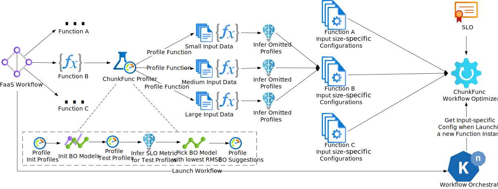

# ChunkFunc

ChunkFunc is a resource configuration optimizer for serverless function workflows that is aware of Service Level Objectives (SLOs) and input data sizes.

## Motivation

When selecting resource configurations (memory size associated with a vCPU count) for serverless functions, people often aim to meet a certain SLO, e.g., max response time (MRT), while minimizing costs.
Many serverless functions exhibit different response times, depending on the size of the input data.
For example, a log processing function will complete faster when processing a 100 MB log file than when processing a 1 GB log file.
Suppose there is a max response time SLO of 4 seconds.
When processing the 1 GB log, a resource configuration with 2 GB memory might be needed to meet the SLO, whereas for the 100 MB log, the resource configuration with 512 MB might be sufficient to fulfill the SLO.
Thus, picking a function's resource configuration depending on the input data size of a particular invocation helps a achieve the SLO, while minimizing costs.

## ChunkFunc Overview

ChunkFunc is a research prototype for input data size-aware selection of resource configurations in serverless workflows, with the aim of fulfilling the workflow's SLO, while minimizing costs.
The prototype is implemented for [Knative](https://knative.dev) as the serverless orchestrator.

ChunkFunc consists of two main components: the ChunkFunc Profiler and the ChunkFunc Workflow Optimizer.
The figure above provides an overview of the (final, planned) system and the lifecycle of a serverless workflow within it.

The *ChunkFunc Profiler* automatically picks up functions of a serverless workflow when they are submitted to the orchestrator and profiles them with their most common input data sizes and the resource configuration profiles available on the underlying platform.
The result of this operation is a performance profile for every common input size.
The profiler can operate in an *exhaustive* mode, where it profiles all specified inputs with all resource profiles or in a *Bayesian Optimization* mode, where it leverages Bayesian Optimization to build a surrogate model of the profiled function under the various resource profiles with typically 1/4 - 1/3 of the exhaustive profiling runs.
As of now, those common input sizes, along with corresponding inputs, need to be defined in a [FunctionDescription](./go/controller/api/v1/functiondescription_types.go) custom resource.
There are examples for our three use case workflows: [log file processing](./go/controller/config/samples/scheduler-log-stats), [video-processing](./go/controller/config/samples/video-processing), and [face-detection](./go/controller/config/samples/face-detection).

The *ChunkFunc Workflow Optimizer* integrates with the serverless orchestrator to provide resource configurations for upcoming serverless function invocations.
It currently supports a max response time (MRT) SLO, but it can be extended with any performance-based SLO.
Before invoking the next function of a workflow, the serverless orchestrator queries the ChunkFunc Workflow Optimizer which resource configuration should be used.
The Workflow Optimizer makes this decision based on the workflow's SLO, the elapsed time within the workflow (for a max response time SLO), the input data size for the function, and the function's performance profiles.
The avoidance of cold starts is (for now) beyond the scope of this project - a simple mitigation strategy would be for the orchestrator to keep a set of warm functions for frequently used resource configurations.

## Implementation

* The [ChunkFunc Profiler](./go) is implemented as a Kubernetes controller using kubebuilder.
* The ChunkFunc Workflow Optimizer is currently implemented as a [simulator](./ts) that replays actual workflow traces to evaluate our algorithms and compare them against other state-of-the-art approaches.
* The [testbed](./testbed) contains three serverless workflows as use cases.

## Deployment & Usage Documentation

Instructions for deployment and usage can be found in the [docs](./docs) folder.
