# Experiment Results 2024-11-15

This page documents the results of an extensive set of experiments conducted using ChunkFunc on November 15, 2024.
This page is an extended version of the evaluation presented in the our paper *Thomas Pusztai and Stefan Nastic, "ChunkFunc: Dynamic SLO-aware Configuration of Serverless Functions"* submitted to the [IEEE Transactions on Parallel and Distributed Systems (TPDS)](https://www.computer.org/csdl/journal/td) journal.

## Setup

We use three real-world and six synthetic serverless workflows.
The real-world workflows are written for our research, but are similar to production use cases.
They represent typical examples of serverless workflows with variable input data size, while exhibiting different response time characteristics.
The real-world workflows are the following:

1. [**LogPro**](https://github.com/polaris-slo-cloud/chunk-func/tree/master/testbed/workflows/scheduler-log-stats) - A log processing workflow, which takes a log file from the [Vela distributed cluster scheduler](https://polaris-slo-cloud.github.io/vela-scheduler/) from an S3-compatible storage bucket as input.
The workflow consists of a sequence of four serverless functions written in TypeScript that validate the log and extract various statistics.

2. [**VidPro**](https://github.com/polaris-slo-cloud/chunk-func/tree/master/testbed/workflows/video-processing) - A video processing workflow that cuts out an unwanted segment of a video from S3, and encodes the rest in a predefined format for social media.
The workflow consists of four functions that validate the video, cut and encode the two segments (two parallel instances of the same function), and merge the encoded segments.
The functions are implemented in TypeScript and use ffmpeg v6.0 with the x264 and AAC codecs for encoding.

3. [**FaceDet**](https://github.com/polaris-slo-cloud/chunk-func/tree/master/testbed/workflows/face-detection) - An ML-based face detection workflow, which detects and marks faces in a video from S3.
It consists of a sequence of four functions: validation, transformation of the video to a standardized resolution, face detection, and marking of all faces in an output video.
Face detection and marking are implemented in Python and rely on the [OpenCV](https://opencv.org) library.

Additionally, we use six synthetic workflows, which are assembled using profiling results from the real-world workflows.
Like the real-world functions, the response time of the functions in the synthetic workflows is dependent on the input size, as determined by the profiling results.
During generation of the workflows, each function’s output is chosen from the set of supported input sizes of the successor function.
For each workflow there are three input size configurations: small, medium, and large.
The synthetic workflows are:

1. **Homogeneous**, a sequence of functions with the same (medium) resource requirements.
2. **LoHiRes**, a sequence of functions with low resource requirements, followed by a sequence of functions with high resource requirements.
3. **HiLoRes**, high resource functions, followed by low resource functions.
4. **Random**, a random sequence of functions with low, medium, and high resource requirements.
5. **Cyclic**, a low resource function, followed by a medium resource, followed by a high resource function, repeated in cycles.
6. **Staircase**, a sequence of low resource functions, followed by a sequence of medium resource functions, followed by a sequence of high resource functions.

The first four workflows consist of 40 functions each, while the last two consist of 42 functions.

In our experiment all functions were deployed on Knative v1.10 on a Kubernetes v1.27 cluster.

We run the experiments with two sets of resource profiles.
The first set of profiles and their costs per 100 ms is coarse-grained and resembles the 128 MB - 16384 MB profiles available on [Google Cloud Functions (GCF)](https://cloud.google.com/functions/pricing) (Tier 2 prices).
Since for GCF there are eight profiles in this memory range, we use exhaustive profiling for this set of resource profiles.
The second set of resources profiles and their costs per 1 ms is fine-grained and resembles the 128 MB - 10240 MB range available on [AWS Lambda](https://docs.aws.amazon.com/lambda/latest/dg/configuration-memory.html).
Every memory size maps to the CPU core count [defined by AWS](https://youtu.be/aW5EtKHTMuQ?t=339).
AWS uses a continuous memory range, which we divide into 64 MB steps, which results in 159 resource profiles, for which we use profiling guided by Bayesian Optimization (BO).

We implement five heuristics:

1. Fastest configuration
2. Cheapest configuration
3. ChunkFunc Proportional Critical Path heuristic (ChunkFunc)
4. ChunkFunc with known function output sizes (CF-Oracle)
5. SLAM (Safaryan et al., "[SLAM: SLO-Aware Memory Optimization for Serverless Applications](http://doi.org/10.1109/CLOUD55607.2022.00019)," in IEEE CLOUD 2022)
6. StepConf (Wen et al., "[Joint Optimization of Parallelism and Resource Configuration for Serverless Function Steps](http://doi.org/10.1109/TPDS.2024.3365134)," IEEE Transactions on Parallel and Distributed Systems, vol. 35, no. 4, 2024)

CF-Oracle is identical to ChunkFunc, except that the former knows all function output sizes from an "oracle" when computing the critical path - this is only used in comparison to ChunkFunc to assess the effectiveness of function output size estimates compared to the actual output sizes when determining the critical path.
Both heuristics compute an average across all resource profiles for the critical path.
SLAM and StepConf both rely on offline profiling to build a performance model of the functions.
We execute all experiments using the exhaustive profiling results and using the BO predicted profiling results.
Since SLAM and StepConf are unaware of different input data sizes, we use the profiling results for each function's median input data size for these strategies.

## Experimental Results

We now discuss the results of the experiments and present a selection of graphs.
All graphs of all experiments can be browsed in the respective folders on GitHub:

- [Experiments with coarse-grained resource profiles and exhaustive profiling (gcf)](https://github.com/polaris-slo-cloud/chunk-func/tree/gh-pages/experiments/2024-11-15/gcf/MaxExecutionTimeSLO)
- [Experiments with fine-grained resource profiles and BO-guided profiling (aws-bo)](https://github.com/polaris-slo-cloud/chunk-func/tree/gh-pages/experiments/2024-11-15/aws-bo/MaxExecutionTimeSLO)
- [Experiments with fine-grained resource profiles and exhaustive profiling (aws)](https://github.com/polaris-slo-cloud/chunk-func/tree/gh-pages/experiments/2024-11-15/aws/MaxExecutionTimeSLO)

### Real-world Workflows

For each real-world workflow we create and profile scenarios with a small, a medium, and a large input size.
To define MRT SLOs we use the fastest and the cheapest configurations as the lower and upper bounds.
For example, for the largest input data size for VidPro the lower and upper bounds for the response time on the coarse-grained profiles are 44,788 ms and 110,089 ms.
We define the $baseSlo = lowerBound + \frac{upperBound - lowerBound}{2}$, e.g., 77.4 s for VidPro.
We explore the SLO interval of $baseSlo \pm N%$ in one percent steps, i.e., $N + 1$ distinct SLOs.
We chose $N$ s.t. the interval does not exceed the bounds given by the fastest and cheapest configurations.
Since the available resources in the lowest and the highest profiles differ between the coarse-grained and the fine-grained resource profile sets, also the lower and upper response time bounds and, hence, the base SLOs differ.
All workflow configuration scenarios are shown in Table 1.

<table>
    <caption>Table 1: Real-world Workflow Scenarios.</caption>
    <thead>
        <tr>
            <th rowspan="2">Workflow</th>
            <th rowspan="2">Input Sizes</th>
            <th colspan="2">SLO Interval (sec) for Profiles</th>
        </tr>
        <tr>
            <th>Coarse-grained</th>
            <th>Fine-grained</th>
        </tr>
    </thead>
    <tbody>
        <tr>
            <td>LogPro</td>
            <td>2.4 MiB 54.3 MiB 95.8 MiB</td>
            <td>12.1s +/- 15% [10.3; 14.0]</td>
            <td>-</td>
        </tr>
        <tr>
            <td>VidPro</td>
            <td>360p - 40 MiB 720p - 227 MiB 1080p - 500 MiB</td>
            <td>77.4s +/- 35% [50.3; 104.5]</td>
            <td>51.0s +/- 35% [33.2; 68.9]</td>
        </tr>
        <tr>
            <td>FaceDet</td>
            <td>20s,    720p - 6.51 MiB 40s,    720p - 26.5 MiB 60s, 1080p - 73.5 MiB</td>
            <td>330s +/- 35% [214.5; 445.4]</td>
            <td>302.2s +/- 35% [196.4; 408.0]</td>
        </tr>
    </tbody>
</table>

#### Coarse-grained Resource Profiles - Exhaustive Profiling

Figure 1 shows the SLO compliance results as response time graphs for the large input data sizes.
Figure 2 and 3 show the SLO compliance results for medium and small input data sizes respectively.
The dashed black line denotes the MRT SLO, i.e., to fulfill the SLO, the workflow’s response time must be equal to or below this line.
Table 2 shows details for all input data sizes.

All heuristics exhibit long periods of straight lines in the response time graphs, because they use a certain set resource configurations until the SLO relaxes enough to use a less powerful resource profile on one function – this behavior causes a straight line in the graph.
Additionally, the relatively short workflows allow only few functions to be adapted, thus increasing the length of the straight lines; the synthetic workflows exhibit many more "steps" in the graphs.

ChunkFunc (standard and CF-Oracle version) is the only heuristic that meets the SLO in all cases across all input sizes.
SLAM and StepConf work well for one or two input sizes, but fail a substantial amount of SLOs in the rest.
SLAM fulfills two thirds of the LogPro SLOs, 69% of VidPro, and 68% of FaceDet.
SLO violations occur for medium and large inputs for FaceDet and only for large inputs for the other two.
Compared to SLAM, ChunkFunc increases SLO adherence by 45% to 49%.
StepConf fulfills 91% of the LogPro SLOs, 78% for VidPro, and 75% for FaceDet.
Most violations occur for large input sizes, but for FaceDet StepConf also misses 27% of the SLOs for medium inputs.
Compared to StepConf, ChunkFunc increases SLO adherence by 10% to 33%.
Across all workflows, SLAM fulfills 68% of the SLOs, while StepConf meets 81%, this amounts to a mean increase in SLO adherence of 47% and 23% respectively, when using ChunkFunc instead.

<table class="figure">
    <caption>
        Figure 1: LogPro, VidPro, and FaceDet Maximum Response Time SLO Compliance for Large Inputs for Coarse-grained Resource Profiles.
    </caption>
    <tr>
        <td>
            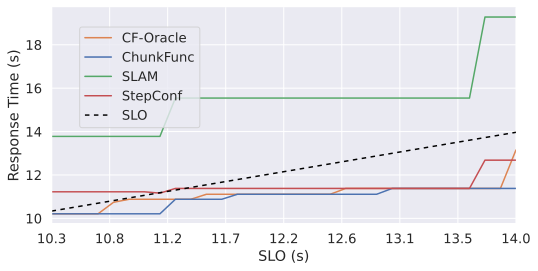
        </td>
        <td>
            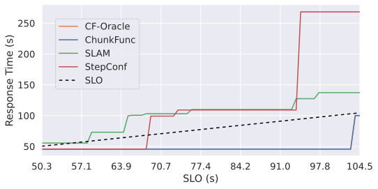
        </td>
        <td>
            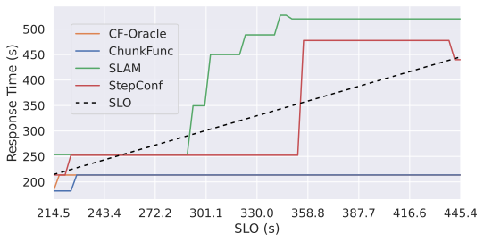
        </td>
    </tr>
    <tr>
        <td>a) LogPro 95.8 MiB Response Times (s)</td>
        <td>b) VidPro 500 MiB Response Times (s)</td>
        <td>c) FaceDet 73.5 MiB Response Times (s)</td>
    </tr>
</table>

<table class="figure">
    <caption>
        Figure 2: LogPro, VidPro, and FaceDet Maximum Response Time SLO Compliance for Medium Inputs for Coarse-grained Resource Profiles.
    </caption>
    <tr>
        <td>
            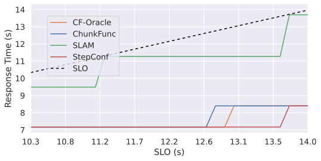
        </td>
        <td>
            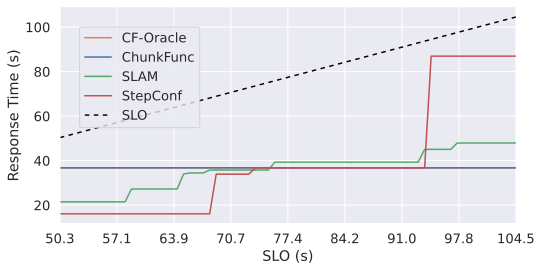
        </td>
        <td>
            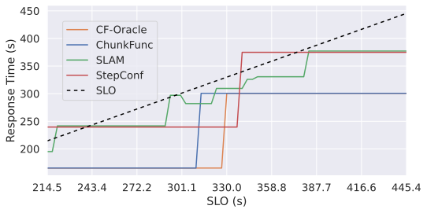
        </td>
    </tr>
    <tr>
        <td>a) LogPro 54.3 MiB Response Times (s)</td>
        <td>b) VidPro 227 MiB Response Times (s)</td>
        <td>c) FaceDet 26.5 MiB Response Times (s)</td>
    </tr>
</table>

<table class="figure">
    <caption>
        Figure 3: LogPro, VidPro, and FaceDet Maximum Response Time SLO Compliance for Small Inputs for Coarse-grained Resource Profiles.
    </caption>
    <tr>
        <td>
            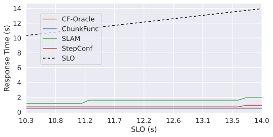
        </td>
        <td>
            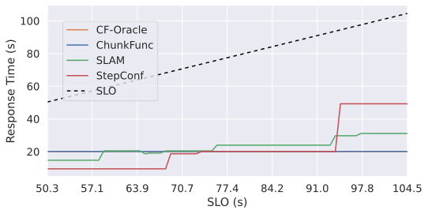
        </td>
        <td>
            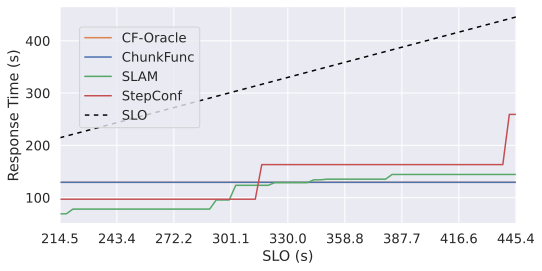
        </td>
    </tr>
    <tr>
        <td>a) LogPro 2.4 MiB Response Times (s)</td>
        <td>b) VidPro 40 MiB Response Times (s)</td>
        <td>c) FaceDet 6.51 MiB Response Times (s)</td>
    </tr>
</table>

<table>
    <caption>Table 2: Real-world Workflows SLO Compliance for Coarse-grained Resource Profiles.</caption>
    <thead>
        <tr>
            <th rowspan="2">Workflow</th>
            <th rowspan="2">Input Size</th>
            <th colspan="6">SLO Adherence</th>
        </tr>
        <tr>
            <th colspan="2">ChunkFunc</th>
            <th colspan="2">SLAM</th>
            <th colspan="2">StepConf</th>
        </tr>
    </thead>
    <tbody>
        <tr>
            <td rowspan="3">LogPro</td>
            <td>Small</td>
            <td colspan="2" rowspan="3">100%</td>
            <td>100%</td>
            <td rowspan="3">67%</td>
            <td>100%</td>
            <td rowspan="3">91%</td>
        </tr>
        <tr>
            <td>Medium</td>
            <td>100%</td>
            <td>100%</td>
        </tr>
        <tr>
            <td>Large</td>
            <td>0%</td>
            <td>74%</td>
        </tr>
        <tr>
            <td rowspan="3">VidPro</td>
            <td>Small</td>
            <td colspan="2" rowspan="3">100%</td>
            <td>100%</td>
            <td rowspan="3">69%</td>
            <td>100%</td>
            <td rowspan="3">78%</td>
        </tr>
        <tr>
            <td>Medium</td>
            <td>100%</td>
            <td>100%</td>
        </tr>
        <tr>
            <td>Large</td>
            <td>6%</td>
            <td>34%</td>
        </tr>
        <tr>
            <td rowspan="3">FaceDet</td>
            <td>Small</td>
            <td colspan="2" rowspan="3">100%</td>
            <td>100%</td>
            <td rowspan="3">68%</td>
            <td>100%</td>
            <td rowspan="3">75%</td>
        </tr>
        <tr>
            <td>Medium</td>
            <td>87%</td>
            <td>73%</td>
        </tr>
        <tr>
            <td>Large</td>
            <td>17%</td>
            <td>51%</td>
        </tr>
        <tr>
            <td>Overall</td>
            <td></td>
            <td colspan="2">100%</td>
            <td colspan="2">68%</td>
            <td colspan="2">81%</td>
        </tr>
    </tbody>
</table>

Figure 4 shows the costs for 10,000 workflow invocations.
If an algorithm violates an SLO the respective cost bar is shown with a hatch pattern, because if the SLO is not met, evaluating the cost is pointless.
To ensure comparability we show the costs for each algorithm only where it meets the SLO.
To avoid bias from SLO violating configurations, when analyzing the costs, we conduct a one-on-one comparison, where we consider only the cases where both strategies meet an SLO.
We compare the mean costs of these cases.
When comparing ChunkFunc to SLAM, ChunkFunc is 4% cheaper for LogPro, 54% cheaper for VidPro, and 19% cheaper for FaceDet.
When comparing to StepConf, ChunkFunc is 165% more expensive for LogPro, 29% cheaper for VidPro, and 22% cheaper for FaceDet.
For LogPro ChunkFunc is more expensive than StepConf for almost all SLOs (for some they are even).
This is because ChunkFunc often picks faster resource profiles, because it knows that it needs to fulfill every sub-SLO for the large input, while StepConf assumes the medium input, for which the sub-SLO can be fulfilled with cheaper resource profiles.
While this approach allows StepConf to save costs, it also causes it to miss the tight SLOs for large inputs.
In the general case, ChunkFunc fulfills more SLOs than StepConf.
In workflows with long-running functions, such as VidPro and FaceDet, ChunkFunc allows saving up to 48% of the costs over StepConf.

<table class="figure">
    <caption>
        Figure 4: LogPro, VidPro, and FaceDet Costs per 10,000 Invocations for Large Inputs for Coarse-grained Resource Profiles.
    </caption>
    <tr>
        <td>
            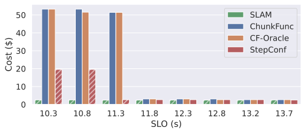
        </td>
        <td>
            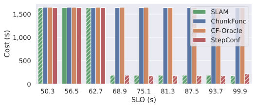
        </td>
        <td>
            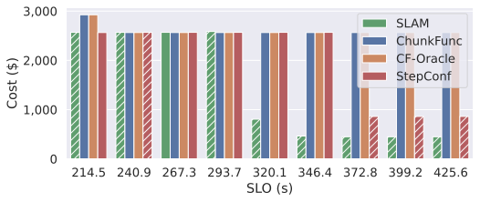
        </td>
    </tr>
    <tr>
        <td>a) LogPro 95.8 MiB Costs per 10,000 Invocations</td>
        <td>b) VidPro 500 MiB Costs per 10,000 Invocations</td>
        <td>c) FaceDet 73.5 MiB Costs per 10,000 Invocations</td>
    </tr>
</table>

#### Fine-grained Resource Profiles - BO-guided Profiling

Figures 5, 6, and 7 show the SLO compliance results as response time graphs for the large, medium, and small input data sizes respectively.
Table 3 shows details for all input data sizes.
The straight lines in the graphs are caused by the same reasons as for the coarse-grained resource profiles.
ChunkFunc is the only heuristic that meets the SLO in all cases across all input sizes.
Its SLO adherence is completely unaffected by whether we use the exhaustive profiling results or the BOinferred profiling results.
SLAM and StepConf work well for one or two input sizes, but fail a substantial amount of SLOs in the rest.
SLAM fulfills two thirds of all VidPro SLOs and 74% of FaceDet, with SLO violations occurring mostly for large inputs.
Compared to SLAM, ChunkFunc increases SLO adherence by 35% to 50%.
StepConf fulfills 62% of the VidPro SLOs and 36% for FaceDet.
Only for small input sizes all the SLOs are met, while as for medium input sizes there are already considerable violations for VidPro and almost entirely violated for FaceDet.
Compared to StepConf, ChunkFunc increases SLO adherence by 61% to 178%.
Across all workflows, SLAM fulfills 71% of the SLOs, while StepConf meets 49%, this amounts to a mean increase in SLO adherence of 41% and 104% respectively, when using ChunkFunc instead.
We have excluded LogPro from the experiment with fine-grained resources profiles.
This is because its functions are single-threaded (Node.JS) with low memory requirements.
Since the fine-grained resource profiles all contain at least one vCPU, there is almost no performance difference between the resource profiles, hence the omission of LogPro from this experiment.

<table class="figure">
    <caption>
        Figure 5: VidPro and FaceDet Maximum Response Time SLO Compliance for Large Inputs for Fine-grained Resource Profiles.
    </caption>
    <tr>
        <td>
            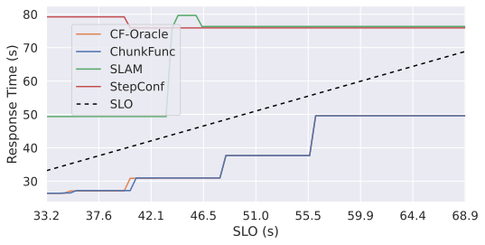
        </td>
        <td>
            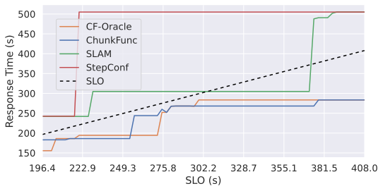
        </td>
    </tr>
    <tr>
        <td>a) VidPro 500 MiB Response Times (s)</td>
        <td>b) FaceDet 73.5 MiB Response Times (s)</td>
    </tr>
</table>

<table class="figure">
    <caption>
        Figure 6: VidPro and FaceDet Maximum Response Time SLO Compliance for Medium Inputs for Fine-grained Resource Profiles.
    </caption>
    <tr>
        <td>
            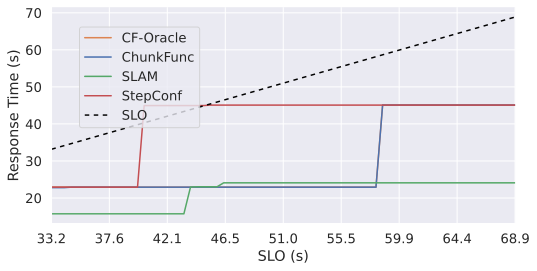
        </td>
        <td>
            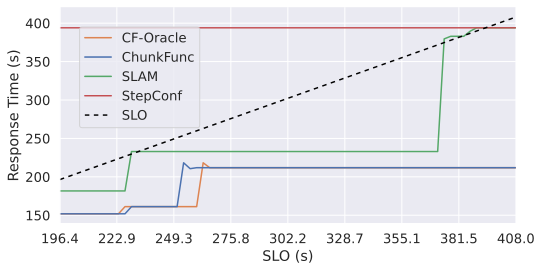
        </td>
    </tr>
    <tr>
        <td>a) VidPro 227 MiB Response Times (s)</td>
        <td>b) FaceDet 26.5 MiB Response Times (s)</td>
    </tr>
</table>

<table class="figure">
    <caption>
        Figure 7: VidPro and FaceDet Maximum Response Time SLO Compliance for Small Inputs for Fine-grained Resource Profiles.
    </caption>
    <tr>
        <td>
            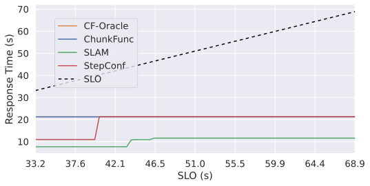
        </td>
        <td>
            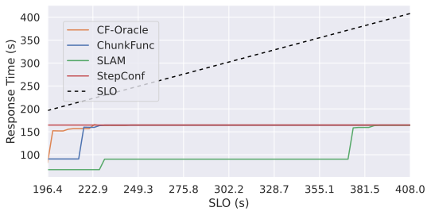
        </td>
    </tr>
    <tr>
        <td>a) VidPro 40 MiB Response Times (s)</td>
        <td>b) FaceDet 6.51 MiB Response Times (s)</td>
    </tr>
</table>

<table>
    <caption>Table 3: Real-worldWorkflows SLO Compliance for BO-inferred Fine-grained Profiles.</caption>
    <thead>
        <tr>
            <th rowspan="2">Workflow</th>
            <th rowspan="2">Input Size</th>
            <th colspan="6">SLO Adherence</th>
        </tr>
        <tr>
            <th colspan="2">ChunkFunc</th>
            <th colspan="2">SLAM</th>
            <th colspan="2">StepConf</th>
        </tr>
    </thead>
    <tbody>
        <tr>
            <td rowspan="3">LogPro</td>
            <td>Small</td>
            <td colspan="2" rowspan="3">100%</td>
            <td>100%</td>
            <td rowspan="3">67%</td>
            <td>100%</td>
            <td rowspan="3">91%</td>
        </tr>
        <tr>
            <td>Medium</td>
            <td>100%</td>
            <td>100%</td>
        </tr>
        <tr>
            <td>Large</td>
            <td>0%</td>
            <td>74%</td>
        </tr>
        <tr>
            <td rowspan="3">VidPro</td>
            <td>Small</td>
            <td colspan="2" rowspan="3">100%</td>
            <td>100%</td>
            <td rowspan="3">69%</td>
            <td>100%</td>
            <td rowspan="3">78%</td>
        </tr>
        <tr>
            <td>Medium</td>
            <td>100%</td>
            <td>100%</td>
        </tr>
        <tr>
            <td>Large</td>
            <td>6%</td>
            <td>34%</td>
        </tr>
        <tr>
            <td rowspan="3">FaceDet</td>
            <td>Small</td>
            <td colspan="2" rowspan="3">100%</td>
            <td>100%</td>
            <td rowspan="3">68%</td>
            <td>100%</td>
            <td rowspan="3">75%</td>
        </tr>
        <tr>
            <td>Medium</td>
            <td>87%</td>
            <td>73%</td>
        </tr>
        <tr>
            <td>Large</td>
            <td>17%</td>
            <td>51%</td>
        </tr>
        <tr>
            <td>Overall</td>
            <td></td>
            <td colspan="2">100%</td>
            <td colspan="2">68%</td>
            <td colspan="2">81%</td>
        </tr>
    </tbody>
</table>

We do not show the cost graphs here, because SLAM and StepConf fail to meet almost all of the SLOs for large inputs.
When comparing ChunkFunc to SLAM one-on-one across all input sizes, where both heuristics meet the SLO, ChunkFunc is 48% cheaper for VidPro and 6% more expensive for FaceDet.
When comparing to StepConf, ChunkFunc is 36% more expensive for VidPro and 42% more expensive for FaceDet.
However, ChunkFunc fulfills many more SLOs than SLAM and StepConf.
This justifies a slight increase in cost for one workflow with respect to SLAM.With respect to StepConf, the cost increases are more substantial.
However, these increases cover less than two thirds of the SLOs for VidPro and only slightly over one third of the SLOs for FaceDet; for the remainder StepConf fails to meet the SLO.

### Synthetic Workflows

#### Coarse-grained Resource Profiles - Exhaustive Profiling

The synthetic workflows are used to evaluate ChunkFunc's scalability in longer, more complex workflows.
The homogeneous, LoHiRes, HiLoRes, and random workflows consist of 40 functions in sequence.
The cyclic and staircase workflows use a short-running, medium-running, and a long-running function, each of which appears 14 times in the workflow, hence they consist of a total of 42 functions.
For all synthetic workflows we simulate scenarios with a small, a medium, and a large input.

Figure 8 shows the SLO adherence for the coarse-grained profiles for the large inputs to all synthetic workflows.
The SLO adherence of the heuristics shows three pattern categories: 

- one for the cyclic, random, and staircase workflows in Figures 8a), c), and e),
- the second one for HiLoRes and LoHiRes workflows in Figures 8b) and d), and
- a distinct pattern for the homogeneous workflow in Figure 8f).

ChunkFunc’s pattern shows only minor differences between the workflows.
It is the only heuristic that meets all SLOs for all input sizes.
StepConf’s pattern remains consistent across all workflows.
For large inputs, it varies closely between fulfilling and violating the SLOs.
Across all six synthetic workflows and three input sizes, it meets 79% of the SLOs, with the lowest value being 60% for the homogeneous workflow and the highest being 96% for the cyclic workflow.
SLAM exhibits the largest differences in its patterns.
It violates all large input SLOs, but fulfills all SLOs for the other inputs, yielding an average adherence of 67%.
For the cyclic, random, and staircase workflows, SLAM’s response times are first close to the SLO line and diverge at some point from it.
For HiLoRes and LoHiRes the response times are always far from the SLO until they plateau out at some point.
For the homogeneous workflow, SLAM’s response times are closer to the MRT SLO line.
For ChunkFunc the results yield an increase in SLO adherence of 27% over StepConf and 50% over SLAM.

For costs, we perform the same one-on-one comparison for fulfilled SLOs that we did for the real-world workflows.
For the cyclic workflow ChunkFunc is 48% cheaper than SLAM and 27% cheaper than StepConf.
For the staircase workflow ChunkFunc only requires 39% of the costs of SLAM, making it 61% cheaper.
On average ChunkFunc is 38% cheaper than SLAM and 10% cheaper than StepConf.

<table class="figure">
    <caption>
        Figure 8: Synthetic Workflows Maximum Response Time SLO Compliance for Large Input Data Sizes with Coarse-grained Resource Profiles.
    </caption>
    <tr>
        <td>
            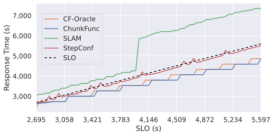
        </td>
        <td>
            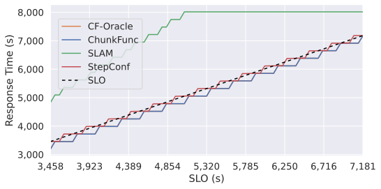
        </td>
    </tr>
    <tr>
        <td>a) Cyclic WF Large Input Response Times (s)</td>
        <td>b) HiLoRes WF Large Input Response Times (s)</td>
    </tr>
    <tr>
        <td>
            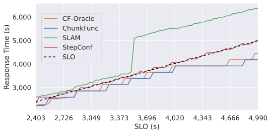
        </td>
        <td>
            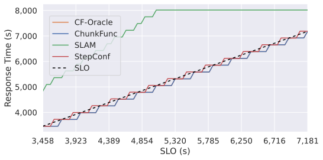
        </td>
    </tr>
    <tr>
        <td>c) Random WF Large Input Response Times (s)</td>
        <td>d) LoHiRes WF Large Input Response Times (s)</td>
    </tr>
    <tr>
        <td>
            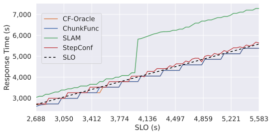
        </td>
        <td>
            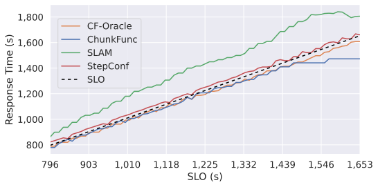
        </td>
    </tr>
    <tr>
        <td>e) Staircase WF Large Input Response Times (s)</td>
        <td>f) Homogeneous WF Large Input Response Times (s)</td>
    </tr>
</table>

#### Fine-grained Resource Profiles - BO-guided Profiling

Figure 9 shows the SLO adherence for the fine-grained resource profiles with large inputs to all synthetic workflows.
We omit the costs for the cyclic workflow for these resource profiles, because only ChunkFunc manages to fulfill all SLOs for large inputs.
The SLO adherence of all but one workflow follows the pattern shown in Figures 9a)-e), where ChunkFunc meets all SLOs, StepConf meets some, but closely misses most SLOs, and SLAM misses all SLOs.
The exception is the homogeneous workflow, shown in Figure 9f), where ChunkFunc fulfills all SLOs, StepConf misses all SLOs, and SLAM fulfills a little less than a quarter of the SLOs.

ChunkFunc is the only heuristic that meets all SLOs for all input sizes for the BO-predicted profiles.
Across all six synthetic workflows and three input sizes, StepConf meets 53% of the SLOs, with the lowest value being 45% for the homogeneous workflow and the highest being 59% for the random workflow.
SLAM meets 65% of all SLOs, with 62% and 74% being the lowest and highest values respectively.
For ChunkFunc this yields an increase in SLO adherence of 89% over StepConf and 54% over SLAM.

<table class="figure">
    <caption>
        Figure 9: Synthetic Workflows Maximum Response Time SLO Compliance for Large Input Data Sizes with Fine-grained Resource Profiles.
    </caption>
    <tr>
        <td>
            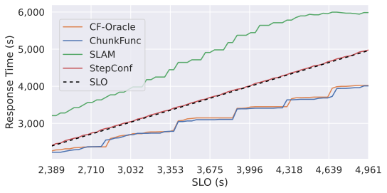
        </td>
        <td>
            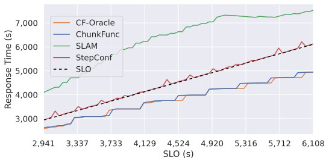
        </td>
    </tr>
    <tr>
        <td>a) Cyclic WF Large Input Response Times (s)</td>
        <td>b) HiLoRes WF Large Input Response Times (s)</td>
    </tr>
    <tr>
        <td>
            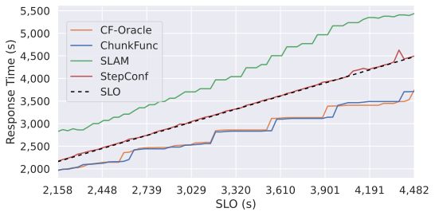
        </td>
        <td>
            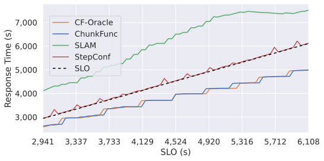
        </td>
    </tr>
    <tr>
        <td>c) Random WF Large Input Response Times (s)</td>
        <td>d) LoHiRes WF Large Input Response Times (s)</td>
    </tr>
    <tr>
        <td>
            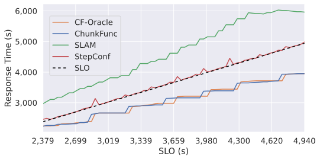
        </td>
        <td>
            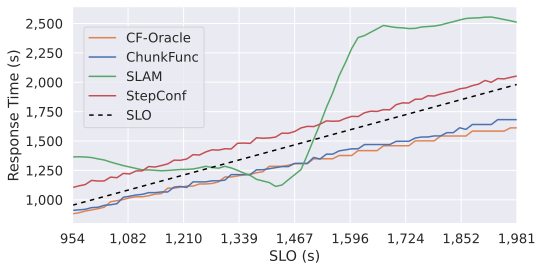
        </td>
    </tr>
    <tr>
        <td>e) Staircase WF Large Input Response Times (s)</td>
        <td>f) Homogeneous WF Large Input Response Times (s)</td>
    </tr>
</table>

For the costs of the cyclic workflow, ChunkFunc amounts to only 49% of the costs of SLAM and 98% of the costs of StepConf.
For the homogeneous workflow ChunkFunc requires 77% more costs than StepConf, but in any other case, ChunkFunc is cheaper.
On average ChunkFunc re- duces costs by 52% compared to SLAM.
Compared to Step- Conf ChunkFunc is 5% more expensive overall, because of the homogeneous workflow.
For the other five workflows, ChunkFunc is on average 9% cheaper than StepConf.

The cost difference between ChunkFunc and CF-Oracle, which knows all function outputs when computing a critical path, is negligible.
Across all experiments with all work- flows and resource profiles ChunkFunc is only 1% more expensive on average, which shows that its critical path estimation works well for keeping costs low, while fulfilling the SLOs.

#### Heuristic Execution Times

Figure 10 examines the execution times of the three heuristics for the synthetic workflows.
We log the execution time for computing each resource profile in a simulation and, then, compute the mean time for determining a single resource profile.
We accumulate these values across all SLOs for an input size.
Since SLAM only performs max-heap operations it is the fastest.
ChunkFunc and StepConf both compute paths through a DAG and show a similar performance, with median values between approx. 1 ms and 1.3 ms for ChunkFunc and close to 0.5 ms for StepConf.
Since ChunkFunc fulfills all SLOs, the slight increase in computation time over StepConf is justifiable and since it is marginal, it does not affect the user experience when invoking a workflow.

<table class="figure">
    <caption>
        Figure 10: Heuristic Execution Times in Synthetic Workflow Experiments for Large Input Data Sizes with Fine-grained Resource Profiles.
    </caption>
    <tr>
        <td>
            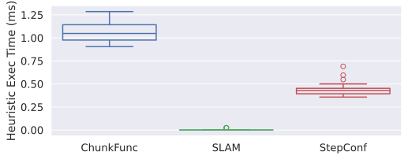
        </td>
        <td>
            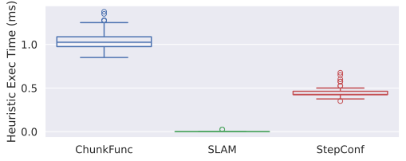
        </td>
    </tr>
    <tr>
        <td>a) Cyclic WF Large Input Heuristic Execution Times</td>
        <td>b) HiLoRes WF Large Input Heuristic Execution Times</td>
    </tr>
    <tr>
        <td>
            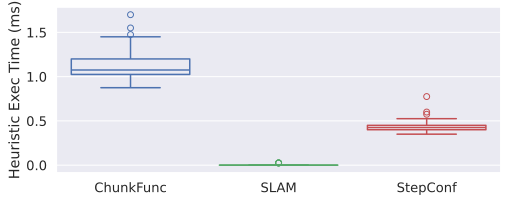
        </td>
        <td>
            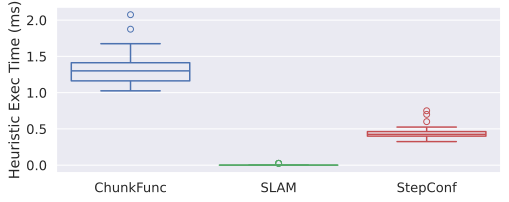
        </td>
    </tr>
    <tr>
        <td>c) Random WF Large Input Heuristic Execution Times</td>
        <td>d) LoHiRes WF Large Input Heuristic Execution Times</td>
    </tr>
    <tr>
        <td>
            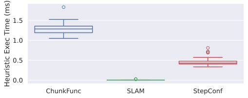
        </td>
        <td>
            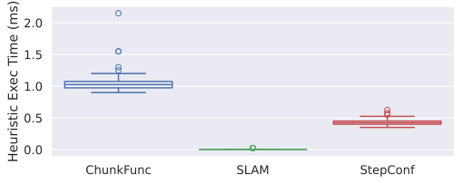
        </td>
    </tr>
    <tr>
        <td>e) Staircase WF Large Input Heuristic Execution Times</td>
        <td>f) Homogeneous WF Large Input Heuristic Execution Times</td>
    </tr>
</table>

